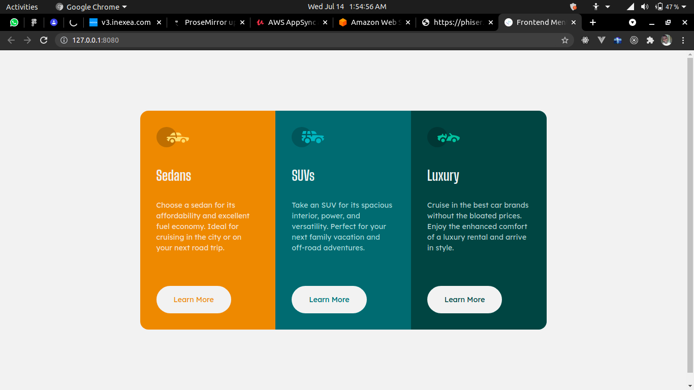

# Frontend Mentor - 3-column preview card component solution

This is a solution to the [3-column preview card component challenge on Frontend Mentor](https://www.frontendmentor.io/challenges/3column-preview-card-component-pH92eAR2-). Frontend Mentor challenges help you improve your coding skills by building realistic projects.

## Table of contents

- [Overview](#overview)
  - [The challenge](#the-challenge)
  - [Screenshot](#screenshot)
  - [Links](#links)
- [My process](#my-process)
  - [Built with](#built-with)
  - [What I learned](#what-i-learned)
- [Author](#author)

## Overview

This is another front end mentor challenge

### The challenge

Users should be able to:

- View the optimal layout depending on their device's screen size
- See hover states for interactive elements

### Screenshot

### Links

- Solution URL: [solution](https://www.frontendmentor.io/solutions/made-with-plain-html-and-css-l_hOiOi9y/report)
- Live Site URL: [3-column-preview-card-component-main](https://3-column-preview-card-component-main-alpha.vercel.app/)

## My process

- built with html and css

### Built with

- Semantic HTML5 markup
- CSS custom properties
- Flexbox

## Author

- Website - [pherwerz](https://pherwerz.vercel.app)
- Frontend Mentor - [@pherwerz](https://www.frontendmentor.io/profile/pherwerz)
- Twitter - [@pherwerzz](https://www.twitter.com/pherwerzz)
